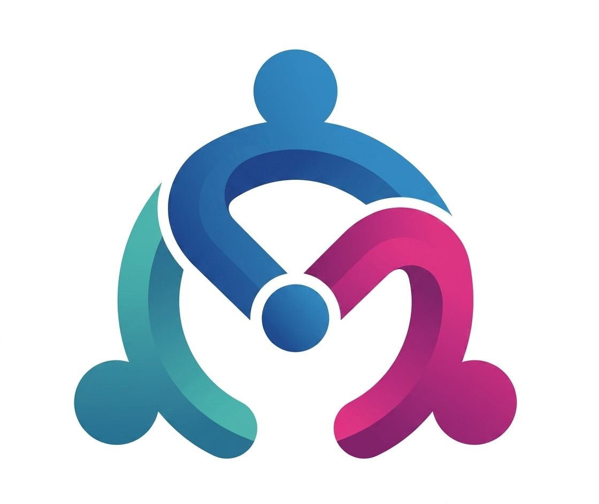

<p align="center"></p>

# Meety — AI Meeting Intelligence

Upload a meeting recording and get back a speaker-separated transcript, a meeting-type-aware summary, per-employee participation metrics, auto-generated tasks, and a memory-aware AI chat that answers questions grounded in everything that's been discussed.

Built for the WINNR Digithon. Covers all three judging pillars — **Input** (upload), **Agent** (transcribe + analyze + remember), **Output** (dashboard + chat).

## What it does

1. **Upload** an audio/video recording (≤ 1 GB). Optionally name the expected participants to improve speaker labeling.
2. **Transcribe** with AssemblyAI — speaker diarization + sentiment + speaker identification.
3. **Analyze** — talk-time %, sentiment, and turn counts per speaker; a summary tailored to the meeting type; and a list of action items with assignees (all via an LLM on OpenRouter).
4. **Remember** — every meeting writes atomic, entity-tagged memories to the Muninn memory layer so knowledge persists across meetings.
5. **Explore** — a dashboard of meetings, a per-meeting detail view (transcript, talk-time chart, summary, editable tasks, per-employee snapshot), and a chat ("Knowledge Vault") that recalls from Muninn and answers grounded questions.

Audio is **deleted from the transcription provider** as soon as it's processed — no recording is retained off-box.

## Stack

| Layer | Choice |
|-------|--------|
| App | Next.js 16 (App Router, TypeScript, Tailwind v4, Turbopack) — full-stack, single deploy |
| Transcription | AssemblyAI (`universal-3-pro`, speaker labels, sentiment, speaker identification) |
| Summary / tasks / chat | OpenRouter (OpenAI-compatible SDK), default model `google/gemini-2.5-flash` |
| Memory | Muninn — MCP JSON-RPC 2.0 over HTTPS, single vault with entity scoping |
| Charts | Recharts |
| Store | JSON file (`data/meetings.json`) for structured meeting objects; Muninn for semantic memory |
| Process / deploy | pm2 on the `winnr` host, exposed over Tailscale |

The JSON store holds the structured source of truth (metrics, tasks, snapshots); Muninn holds the semantic memory the chat recalls from. The split is deliberate — exact data vs. fuzzy recall.

## Project layout

```
app/
  page.tsx                       Dashboard: upload + meeting list + CRUD
  meetings/[id]/page.tsx         Meeting detail
  chat/page.tsx                  Knowledge Vault chat
  recordings/page.tsx            Recordings: transcript search archive
  api/
    ingest/route.ts              POST upload → kicks off the pipeline
    meetings/route.ts            GET list (?archived=1 for archived)
    meetings/[id]/route.ts       GET / PATCH (edit, rename, archive) / DELETE
    meetings/[id]/jira/route.ts  GET status / POST push action items to Jira
    meetings/[id]/reindex/       POST re-write memories to Muninn
    recordings/route.ts          GET transcript search
    chat/route.ts                POST question → recall → LLM → answer
lib/
  assembly.ts    AssemblyAI client (transcribe + delete transcript)
  llm.ts         OpenRouter client (summary, tasks, chat)
  muninn.ts      Muninn MCP client (remember, recall, forget)
  jira.ts        Jira Cloud REST client (create issues)
  pipeline.ts    Ingest pipeline + memory sync
  metrics.ts     Participation math (talk-time %, largest-remainder rounding)
  store.ts       JSON file store (list / get / save / update / delete)
  types.ts       Shared domain types
components/      Sidebar, MeetingCard, PeopleBoard, TalkTimePanel, Badge, Markdown, …
docs/            Design specs
```

## Getting started

```bash
cp .env.local.example .env.local   # fill in the keys (see below)
npm install
npm run dev                        # http://localhost:3000
```

### Environment variables

| Var | Purpose |
|-----|---------|
| `ASSEMBLYAI_API_KEY` | Transcription + diarization + sentiment |
| `OPENROUTER_API_KEY` | Summary, task generation, chat |
| `OPENROUTER_MODEL` | LLM model id (default `google/gemini-2.5-flash`) |
| `MUNINN_URL` | Muninn MCP endpoint (on `winnr` itself use `http://localhost:8750/mcp`) |
| `MUNINN_TOKEN` | Muninn vault API key |
| `MUNINN_VAULT` | Vault name (`winnr-meetings` for the app) |

## Meeting CRUD

- **Create** — upload on the dashboard.
- **Read** — meeting list + detail view.
- **Update** — edit title/type/project/department; rename speakers (recomputes metrics); edit tasks.
- **Archive** — soft-delete; hidden from the default list, shown under the **Archived** tab, restorable.
- **Delete** — permanent; also forgets the meeting's memories from the Knowledge Vault (by stored memory ids, with an entity-lookup fallback for older meetings).

## Roadmap

The sidebar's "Soon" items are specced in `docs/superpowers/specs/2026-06-07-meeting-crud-and-features-design.md`:

- **Task Tracker** — all tasks across meetings in one view, filterable, toggle-done.
- **Insights** — cross-meeting analytics: per-employee trends, per-project/department rollups, company overview, AI-generated narrative.
- **Recordings** — searchable transcript archive (no audio retained).

Post-MVP: live meeting integration (Recall.ai), realtime transcription, burnout/communication-pattern signals.

## Deploy

Deployed with pm2 and exposed over Tailscale. See `DEPLOY.md` for host setup, build, and reload steps.
